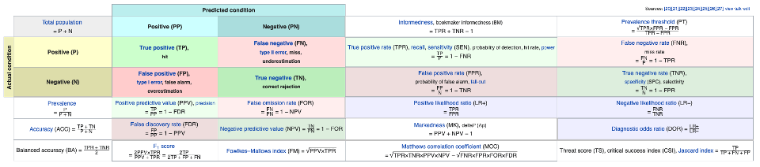
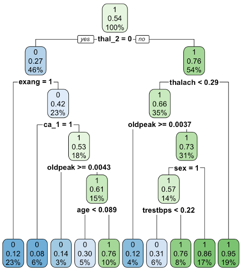
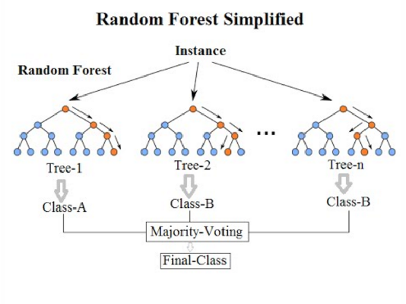

# Introduction: What is machine learning? 

Machine learning is a combination of statistics and computer science that is often defined as an algorithm, computer, or other machine that can learn on its own as it is given more data and without human input. This definition easily becomes conflated with opaque ideas of "artificial intelligence" and is too frequently associated with romanticized technological advancements in transportation, robotics, cognition, and human-computer interaction - although it does apply to these fields. 

However, we thankfully do not need to think of machine learning in such complicated terms. Instead, it can be thought of as a toolbox for exploring data for application to research problems in virtually all fields of study. We can think of machine learning as a 

> "vast set of tools for _understanding data_. These tools can be classified as supervised or unsupervised. Broadly speaking, supervised statistical learning involves building a statistical model for predicting, or estimating, an output based on one or more inputs... With unsupervised statistical learning, there are inputs but no supervising output; nevertheless we can learn relationships and structure from such data." 
> (James et al. 2021, p. 1). 

[James G, Witten D, Hastie T, Tibshirani R. 2021. An Introduction to Statistical Learning: With Applications in R, 2nd edition.](https://www.statlearning.com)

## Machine learning terminology

Machine learning tasks are generally defined as belonging to one of a small handful of groups: supervised, unsupervised, deep, semi-supervised, reinforcement, and targeted/causal. 

Our focus in this workshop is on supervised learning for classification using the [SuperLearner R package](https://cran.r-project.org/web/packages/SuperLearner/index.html) and we will follow the [Guide to SuperLearner](https://cran.r-project.org/web/packages/SuperLearner/vignettes/Guide-to-SuperLearner.html). 

1. **Supervised learning:** is a predictive technique that trains a model on known, labeled data. The goal is to understand the relationships between variables in a dataset so that the trained model can be used to make predictions on new data it has not yet seen and whose labels are unknown. Or, 

> "We wish to fit a model that relates the response to the predictors, with the aim of accurately predicting the response for future observations (prediction) or better understanding the relationship between the response and the predictors (inference)." (James et al. 2021, p. 26)

- __Classification:__ is the supervised task when the Y variable is discrete/categorical.
  
- __Regression:__ is the supervised task when the Y variable is continuous (i.e., numeric or integer). 

2. **Supervised syntax**

$Y ~ X1 + X2 + X3 ... + Xn$

Simply put, we want to use the X variables to predict Y. 

3. **X and Y variables:** 

- __X__ is/are the independent variable(s) that we use to do the predicting. These are also referred to as features, covariates, predictors, and explanatory/input variables. 

- __Y__ is the dependent variable and the one we want to predict. It is also referred to as the outcome, target, or response variable. Although predicting the label itself might be convenient, predicting the class probabilities is more efficient. 

4. **Data splitting:** Predictions are usually evaluated twice: 1) first on the training set to see how well the model can learn the relationships between the **X** and **Y** variables, and then 2) on the test set to see how well the trained model can generalize to predicting on new data. To accomplish this task, a given dataset is divided into training and test sets. 

> NOTE: a validation set is also sometimes used for hyperparameter tuning/model selection on the training dataset. 

- The **training set:** generally consists of the majority portion of the original dataset (70%, for example) where the model can learn the relationships between the **X** and **Y** variables. 
  - __Hyperparameters:__ are the configurations manually set by the programmer prior to model training through heuristics and trial and error. We do not know the optimal combinations of these options, and must tune the hyperparameters through the model training process to optimize prediction performance. 

- The **test set:** consists of the remaining portion of the dataset (30% in this example) that the trained model will then try to predict without seeing the Y labels. 

- **[k-fold cross-validation:](https://en.wikipedia.org/wiki/Cross-validation_(statistics))** is a preferred method for approaching the data splitting process because it repeats the train/test split process "k" number of times and rotates portions of the dataset to ensure that each observation is in the test set at least once. 


5. **Performance metrics:** It is necessary to evaluate model performance on the training and test sets (and validation set, when applicable) through a variety of [confusion matrix derivations](https://en.wikipedia.org/wiki/Confusion_matrix). 

We will focus on two classification metrics in this workshop: 
1. Risk - as measured by [mean squared error](https://en.wikipedia.org/wiki/Mean_squared_error)
2. [AUC-ROC](https://en.wikipedia.org/wiki/Receiver_operating_characteristic#Area_under_the_curve) - area under the curve - receiver operator characteristic; a measure of true positive rate versus true negative rate



- A model is **underfit** if it cannot learn the relationships between the **X** and **Y** variables on the training set. 

- A model is **overfit** if it adequately learns the relationships between the **X** and **Y** variables and performs well on the training set, but performs poorly on the test set. 

## Example machine learning workflow

1. Read literature in your field to understand what has been done; annotate what you read
2. Formulate a research question(s)
3. Obtain data
4. Preprocess data
- scale variables when necessary
- handle missing values if present (listwise delete, median impute, generalized low rank model impute, etc.)
- convert factor variables to numeric indicators if present
5. Define x and y variables
6. Split data into train and test sets
7. Train and evaluate performance of a single algorithm on as a prototype
8. Examine the trained model's performance on the test set
9. Create and deploy a cross-validated ensemble

# Today's topic: Predicting heart disease


We investigate how well individual algorithms and a SuperLearner ensemble weighted average can predict heart disease (yes/no) using other health indicators as features/predictors. Learn more about the dataset at the [UCI Machine Learning Repository](https://archive.ics.uci.edu/ml/datasets/heart+disease)

# SuperLearner

> SuperLearner is an algorithm that uses cross-validation to estimate the performance of multiple machine learning models, or the same model with different settings. It then creates an optimal weighted average of those models, aka an "ensemble", using the test data performance. This approach has been proven to be asymptotically as accurate as the best possible prediction algorithm that is tested. [Guide to SuperLearner - 1 Background](https://cran.r-project.org/web/packages/SuperLearner/vignettes/Guide-to-SuperLearner.html)

In this manner, a SuperLearner ensemble is a powerful tool because it:

1. Eliminates bias of single algorithm selection for framing a research problem

2. Allows for comparison of multiple algorithms, and/or comparison of the same model but tuned in many different ways

3. Utilizes a second-level algorithm that produces an ideal weighted prediction that is suitable for data of virtually all distributions and uses external cross-validation to prevent overfitting. 

**Read the papers:**

- [Kennedy C. 2017. Guide to SuperLearner](https://cran.r-project.org/web/packages/SuperLearner/vignettes/Guide-to-SuperLearner.html)

- [Van der Laan, M.J.; Polley, E.C.; Hubbard, A.E. Super Learner. Stat. Appl. Genet. Mol. Biol. 2007, 6, 1–21.](https://www.degruyter.com/document/doi/10.2202/1544-6115.1309/html)

- [Polley, E.C.; van der Laan, M.J. Super Learner in Prediction, UC Berkeley Division of Biostatistics Working Paper Series Paper 266.](https://biostats.bepress.com/ucbbiostat/paper266/)

# Setup

## Package installation

Install and library the packages we will use in this workshop. The `pacman` package management tool handles everything for you in the code chunk below. 

You should consider using it (or something like it) for your own research. [Read the documentation here](https://www.rdocumentation.org/packages/pacman/versions/0.5.1).

```{r}
if (!require("pacman")) install.packages("pacman")

pacman::p_load("caret",         # create stratified random split of the dataset
               "ck37r",         # Chris Kennedy's Machine Learning Helper Toolkit
               "ggplot2",       # visualize risk and ROC
               "glmnet",        # the elastic net algorithm
               "ranger",        # random forest algorithm
               "rpart",         # decision tree algorithm
               "scales",        # for scaling data
               "SuperLearner",  # fit individual algorithms and ensembles
               "ROCR",          # compute AUC-ROC performance
               "xgboost")       # boosted tree algorithm
```

### The ck37r package

If the CRAN installation for the ck37r package does not work correctly, install it from GitHub by unhashtagging the three lines of code below. 

```{r}
# install.packages("remotes")
# remotes::install_github("ck37/ck37r")
# library(ck37r)
```

# Import and preprocess the data

Import and preprocess the data in six steps, and create a new variable for each step: 

1. **Import the dataset:** The variable `raw` contains data from the raw .csv file.

2. **Convert categorical variables:** `raw_fac` is used to convert categorical variables to factor type.

3. **Convert factors to numeric indicators:** `raw_df` will be for conversion of factors to numeric indicators.

4. **Identify and remove variables to be scaled:** `removed` consists of the preprocessed data _excluding_ the continuous variables to be scaled.

5. **Scale the continuous variables:** `rescaled` is the variable for the scaled variables.

6. **Produce clean dataset:** `clean` is the final merged dataset; a combination of the variables `removed` and `rescaled`.

7. **Save the clean dataset:** using the `save` function. You can load it with the `load` function so you do not have to repeat these preprocessing steps again. 

## 1. Import the dataset

Read in the raw .csv file and save it in a variable named `raw`.

```{r}
raw <- read.csv("data/raw/heart.csv")
str(raw)
```

## 2. Convert categorical variables

The variables cp, restecg, slope, ca, and thal are variables to be converted to nominal categorical type. Perhaps ordinal factors could be even more appropriate.

Save this factorized version in a variable named `raw_fac`. 

```{r}
raw_fac <- ck37r::categoricals_to_factors(data = raw, 
                                          categoricals = c("cp", "restecg", "slope", "ca", "thal"))
str(raw_fac)
```

## 3. Convert factors to numeric indicators

Most machine learning algorithms require that input and output variables are numeric and therefore do not handle factor data well (although with some exceptions). 

Therefore, we want to convert the factor variables to numeric indicator variables (aka one-hot/dummy coding). [See a few examples here](https://datatricks.co.uk/one-hot-encoding-in-r-three-simple-methods).

Name this variable `raw_df`. 

```{r}
# Save this as an intermediate variable named raw_ind 
raw_ind <- ck37r::factors_to_indicators(data = raw_fac, 
                                        verbose = TRUE)

# Extract the actual data portion from raw_ind and save as raw_df
raw_df <- raw_ind$data
str(raw_df)
```

## 4. Identify and remove variables to be scaled

Identify and remove the variables age, trestbps, chol, thalach, and oldpeak to be scaled.

```{r}
# First, investigate the data to identify variables to scale
names(raw_df)
summary(raw_df)
summary(raw_df[,c("age", "trestbps", "chol", "thalach", "oldpeak")])

# Save this as an intermediate variable named to_scale
to_scale <- raw_df[,c("age", "trestbps", "chol", "thalach", "oldpeak")]
```

> Also see `?ck37r::standardize` for a simple extension

Remove the variables to be scaled and save the remaining variables in a dataframe named `removed`. 

```{r}
removed <- raw_df[,-c(1, # age
                      3, # trestbps
                      4, # chol
                      6, # thalach
                      8  # oldpeak
                      )]
```

## 5. Scale the continuous variables

Rescale these variables to a rang of 0 to 1 in a variable named `rescaled`. 

```{r}
rescaled <- as.data.frame(rescale(as.matrix(to_scale), to = c(0,1), ncol = 1))
summary(rescaled)
```

## 6. Produce clean dataset

Finally, recombine the original data with the scaled variables for the final `clean` dataset. 

```{r}
clean <- cbind(removed,       # cleaned data without the scaled variables
               rescaled       # scaled variables
               )

# The scaled variables are the last five!
str(clean)
```

### Save the `clean` dataset

Save the clean dataset so you do not have to repeat these preprocessing steps.

```{r}
save(clean,                                  # variable(s) to be saved
     file = "data/preprocessed/clean.RData") # file name

# You can always load the clean dataset with
load("data/preprocessed/clean.RData")
```

# Stay organized

One handy way to keep your machine learning organized is by storing all the components in a list. Let's call our list `heart_class`, for our task of heart disease classification.

Our first two list components will be the dataset and outcome variable. In the heart dataset, the `target` variable is coded with a 1 if the patient had heart disease and a 0 if they did not.

```{r}
heart_class <- list(
  data = clean, 
  outcome = "target"
)

# View the list contents
names(heart_class)

# Access part of the list with the dollar sign
head(heart_class$data)
heart_class$outcome
```

## Add covariates

```{r}
heart_class$covariates <- setdiff(names(heart_class$data), heart_class$outcome)

# The covariate names appear in the heart_class list!
names(heart_class)

# Call the covariates with (notice that "target" is excluded)
heart_class$covariates
```

## Add training rows

```{r}
set.seed(1) 
training_rows <- 
  caret::createDataPartition(heart_class$data[[heart_class$outcome]], 
                             p = 0.70, 
                             list = FALSE)

heart_class$train_rows <- training_rows

# We have added the training rows to our list
names(heart_class)
head(heart_class$train_rows)
```

## Split data into training and test sets

```{r}
x_train <- heart_class$data[heart_class$train_rows, heart_class$covariates]
y_train <- heart_class$data[heart_class$train_rows, heart_class$outcome]

x_test <- heart_class$data[-heart_class$train_rows, heart_class$covariates]
y_test <- heart_class$data[-heart_class$train_rows, heart_class$outcome]

# Mean and frequencies of training set
mean(heart_class$data[training_rows, "target"])
table(heart_class$data[training_rows, "target"])

# Mean and frequencies of test set
mean(heart_class$data[-training_rows, "target"])
table(heart_class$data[-training_rows, "target"])

# Add these variables to our list for safekeeping
heart_class$x_train <- x_train
heart_class$y_train <- y_train
heart_class$x_test <- x_test
heart_class$y_test <- y_test
names(heart_class)

# For example,
heart_class$y_train

# Also save X and Y for the ensemble
heart_class$Y <- clean$target
heart_class$X <- clean[,-4] 
```

### Save the list `heart_class`

This way, you do not have to repeat all of these steps. You can just `load("data/preprocessed/heart_class.RData")`

```{r}
names(heart_class)

save(heart_class,
     file = "data/preprocessed/heart_class.RData")

# Load it with the load() function
load("data/preprocessed/heart_class.RData")
```

# Fit single models

It is often good to fit a single model to prototype your machine learning goals. 

Let's fit three! Click the links for more information.

1. [Single decision tree](https://www.amazon.com/Classification-Regression-Wadsworth-Statistics-Probability/dp/0412048418)

2. [Random forest](https://link.springer.com/article/10.1023/A:1010933404324)

3. [Lasso](https://cran.r-project.org/web/packages/glmnet/vignettes/glmnet.pdf)

## View available models

SuperLearner supports a wide variety of useful algorithms:

```{r}
listWrappers()
```

## Decision tree

A decision tree is an algorithm is useful because they are relatively simple to construct and interpret. They can work with categorical data directly, without the need for one-hot encoding. 

Decision trees work by recursively partitioning, or partitioning, the feature space into smaller regions that contain less data. Splitting takes place at **nodes** and each directional split is called a **branch**. The top node is called the **root node** and seeks to find the most discriminating split, thus always putting the most optimal partition first. 

Keep in mind that single decision trees are prone to overfitting and high variance.

The tree stops partitioning when it fails to meet some hyperparameter condition. See `?rpart.control` for a list of tunings. 

Unhashtag the below code to reproduce the tree figure for the training data.

- [Check out this tutorial for a step-by-step decision tree walkthrough](https://www.gormanalysis.com/blog/decision-trees-in-r-using-rpart/) 

- [Understand the magic behind constructing a decision tree](https://www.gormanalysis.com/blog/magic-behind-constructing-a-decision-tree/)

- [Read this stackoverflow thread about decision tree information gain.](https://stackoverflow.com/questions/4553947/decision-tree-on-information-gain)

```{r eval = F}
?rpart.control
# install.packages("rpart.plot")
# library(rpart.plot)
# (dt_example_plot <- rpart(y_train ~ ., 
#                           data = x_train, 
#                           method = "class",
#                           parms = list(split = "information")))
# rpart.plot(dt_example_plot)
```



### Train the model with SuperLearner

```{r}
set.seed(1)
dt <- SuperLearner(Y = heart_class$y_train, 
                   X = heart_class$x_train, 
                   family = binomial(),
                   SL.library = "SL.rpart")
dt

# Accuracy
(dt_acc <- 1 - dt$cvRisk)
```

### Test set AUC-ROC: 

```{r}
# Predict on test set
dt_predictions = predict(dt, heart_class$x_test, onlySL = TRUE)
str(dt_predictions)
summary(dt_predictions$library.predict)

# Visualize predicted probabilities
qplot(dt_predictions$pred[, 1]) + theme_minimal()

# Compute AUC-ROC and save as variable
dt_rocr_score = ROCR::prediction(dt_predictions$pred, y_test)
dt_auc_roc = ROCR::performance(dt_rocr_score, measure = "auc", x.measure = "cutoff")@y.values[[1]]

# AUC-ROC
dt_auc_roc
```

## Random forest

The random forest algorithm is a big step up from a single decision tree. 

It is a **forest** because it grows multiple decision trees. 

It is **random** because it bootstrap samples (with replacement) two-thirds of the dataset for each tree (this is called bootstrap aggregating, or "bagging") and evaluates performance on the remaining one-third of the data (called the "out-of-bag" sample). 

It is also **random** because instead of trying to place the most discriminating split as the root node, it selects a random sample of features to try at each split. This allows for good splits to be followed by bad splits, and for bad splits to be followed by good splits thus helping decorrelate the average performance estimator for a more robust conclusion. 

See `?ranger` for hyperparameter tuning options.

```{r eval = F}
?ranger
```

- [Read the ranger paper for explanations and examples.](https://arxiv.org/pdf/1508.04409.pdf). 



### Train the model

```{r}
set.seed(1)
rf <- SuperLearner(Y = heart_class$y_train, 
                   X = heart_class$x_train, 
                   family = binomial(),
                   SL.library = "SL.ranger")
rf

# Accuracy
(rf_acc <- 1 - rf$cvRisk)
```

### Test set AUC-ROC:

```{r}
rf_predictions = predict(rf, heart_class$x_test, onlySL = TRUE)
str(rf_predictions)
summary(rf_predictions$library.predict)

# Visualize predicted probabilities
qplot(rf_predictions$pred[, 1]) + theme_minimal()

# Compute AUC-ROC and save as variable
rf_rocr_score = ROCR::prediction(rf_predictions$pred, y_test)
rf_auc_roc = ROCR::performance(rf_rocr_score, measure = "auc", x.measure = "cutoff")@y.values[[1]]

# AUC-ROC 
rf_auc_roc
```

## Lasso

The lasso (least absolute square shrinkage operator) is a form of penalized regression and classification that shrinks the beta coefficients to zero of features that are not related to the outcome variable. 

We can follow the "one standard error rule", which allows us to select a higher lambda value (the regularization parameter) within one standard error of the minimum value and sacrifice a little error for a model that contains less variables but is ostensibly easier to interpret. 

View the help files with `?glmnet` and `?cv.glmnet` to learn more.

```{r eval = F}
?glmnet
?cv.glmnet
```


- [Remember to read An Introduction to glmnet](https://cran.r-project.org/web/packages/glmnet/vignettes/glmnet.pdf)

```{r}
set.seed(1)
lasso <- cv.glmnet(x = as.matrix(heart_class$X), 
                   y = heart_class$Y, 
                   family = "binomial", 
                   alpha = 1)
lasso

# View path plot
plot(lasso)

# View coefficients
plot(lasso$glmnet.fit, xvar = "lambda", label = TRUE)

# Show coefficients for 1se model
(coef_min = coef(lasso, s = "lambda.1se"))
```


### Lasso - train the model

```{r}
set.seed(1)
la <- SuperLearner(Y = heart_class$y_train, 
                   X = heart_class$x_train, 
                   family = binomial(),
                   SL.library = "SL.glmnet")
la

# 0.86 accuracy
(la_risk <- 1-la$cvRisk)
```

### Lasso test set AUC-ROC:

```{r}
la_predictions = predict(la, heart_class$x_test, onlySL = TRUE)
str(la_predictions)
summary(la_predictions$library.predict)

# Visualize predicted probabilities
qplot(la_predictions$pred[, 1]) + theme_minimal()

# Compute AUC-ROC and save as variable
la_rocr_score = ROCR::prediction(la_predictions$pred, y_test)
la_auc_roc = ROCR::performance(la_rocr_score, measure = "auc", x.measure = "cutoff")@y.values[[1]]

# AUC-ROC 
la_auc_roc
```

# Ensemble

Now, lets fit an ensemble with two more algorithms include:

4. [xgboost](https://www.google.com/search?client=firefox-b-1-d&q=short+introduction+to+boosting+freund)

5. [The mean of Y](https://biostats.bepress.com/ucbbiostat/paper266/)

## Summary of algorithm definitions


## Train the ensemble of models

```{r}
set.seed(1)
cv_sl <- CV.SuperLearner(Y = heart_class$Y,  # heart disease yes/no
                         X = heart_class$X,  # excluding the "target" variable
                         family = binomial(),
                         # For your own research, 5, 10, or 20 are good options
                         cvControl = list(V = 5), 
                         innerCvControl = list(list(V = 5)),
                         verbose = TRUE, 
                         method = "method.NNLS",
                         SL.library = c("SL.rpart",   # decision tree
                                        "SL.ranger",  # random forest
                                        "SL.glmnet",  # lasso
                                        "SL.xgboost", # boosted trees
                                        "SL.mean"))   # Y mean
```

## Explore the output

```{r}
# Learn more about what is contained within the model
cv_sl

# View the risk table
summary(cv_sl)

# View the discrete winner
table(simplify2array(cv_sl$whichDiscreteSL))

# View the AUC-ROC table for: 
# 1. The individual algorithms
# 2. The discrete winner
# 3. The SuperLearner ensemble
ck37r::auc_table(cv_sl)

# Visualize the cross-validated risk
plot.CV.SuperLearner(cv_sl) + theme_bw()

# Print the weights table
cvsl_weights(cv_sl)

# Compute ensemble AUC-ROC 
ck37r::cvsl_auc(cv_sl)

# Plot ROC curve
ck37r::plot_roc(cv_sl)

# View rough estimates of variable importance
set.seed(1)
var_importance <- ck37r::vim_corr(covariates = heart_class$covariates, 
                                  outcome = heart_class$outcome, 
                                  data = clean, 
                                  bootse = FALSE, 
                                  verbose = TRUE)
var_importance
```

# Challenge

## Customize model hyperparameters and refit the ensemble

Read Chapter 9 and Chapter 10 in the Guide to SuperLearner to learn to customize model hyperparameters and test algorithms with multiple hyperparameter settings. 

Refit the ensemble with a few new, tuned algorithms compared to the existing algorithms contained within the `SL.library` parameter inside of `CV.SuperLearner` above ("SL.rpart", "SL.ranger", "SL.glmnet",  "SL.xgboost", "SL.mean"). 

What changed, and how were you able to optimize performance? 

How did you find out which hyperparameters to tune?

> HINT: type `?rpart`, `?ranger`, etc.

# Other tutorials

caret: https://topepo.github.io/caret/

tidymodels: https://www.tidymodels.org/

mikropml: http://www.schlosslab.org/mikropml/articles/paper.html
