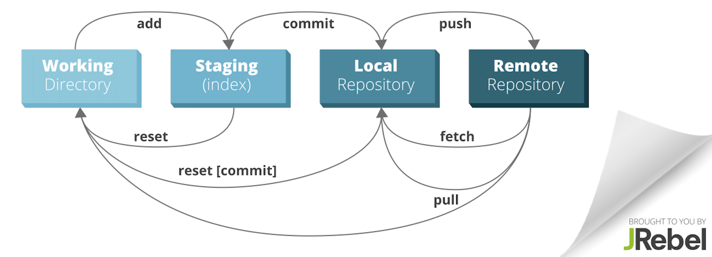

# Intro to Unix and Git for Academics

This is a very gentle introduction for non-programmers to the most basic, text-based
ways to do things with a computer: the Unix (or Linux) command line. Sometimes considered
arcane, off-putting, or just old-fashioned, a bit of command line knowledge is still
required for much digital humanities and social science work, even on a modern Mac or PC --
knowledge that is too often treated as implicit, but too seldom taught. We will also
cover the basics of Git, the near-universal version-control system that is one of basic
toolkits of digital scholarship and especially collaboration. This workshop is a safe
space for people of all experience levels, with no question too basic to ask!

Prerequisites: None. Please bring your own computer. It would be helpful before the
class to create a free account on http://github.com if you don’t have one.

## Learning goals
* To understand what the command line is, and how it relates to our customary graphical user interfaces
* To understand files, directories, paths, commands, and how they interact 
* To become familiar with 10 Unix commands with their syntax
* To be introduced to 2 Unix programs (for editing text and transferring files)
* To become familiar with version control using Git

## Pre-workshop prep

### Windows: install Git Bash
https://gitforwindows.org/ -- 
which provides both a Unix-like shell and Git.

### Mac: install Git
https://git-scm.com/downloads

## PART I. Unix and the command line
### What are they, and why do we need them?

### How to get started
- on a Mac: the `Terminal` app
- on Windows: the `Bash` program

### Defining terms
- Shell, command line, prompt
- File
- Directory
- Path
- Command (or program)

### Unix syntax
A language analogy:
* `command` `[-flag(s)]` `object1` `object2` 
* Verb  [Adverb]  DirectObject  IndirectObject

### A few essential Unix commands
`ls`

`pwd`

`cp`

`mv`

`rm`

`cat`

`wc`

`grep`

`cd`

`./`

`../`

`mkdir`

`rmdir`

`|`

`>` `>>`

`man`

TAB completion

↑ command history

`ssh`

`sftp`
(plus commands within)

`vi`
(plus commands within)

## PART II. Git

### Why do we care about version control and git?

- Addresses issue of multiple versions and drafts of files
- Provides capacity to easily move between different versions of files (a la Google Sheets, but locally)
- Facilitates collaboration
- Facilitates backup and storage through remote repositories/hosting
- Lets us work within a community standard technology/framework

### Let's make sure that git is installed for everyone.

- In terminal in Mac or Git Bash in Windows, type `git help`. If you get a long message with all the options for git, it's working fine.

### Conceptual model of git

- Working directory
- Staging area
- Local Git repository (repo for short)
- Remote Git repository

### Setting up git and Github

- Sign up for Github if you haven't: [Github](https://github.com/).
- Modify git config to set your email and username. For your email, keep it the same as the email you used to sign up with Github.
  - Username: `git config --global user.name "Mona Lisa"`
  - Email: `git config --global user.email "email@example.com"`

We're setting these options globally, meaning it's set for git for all of your directories or repositories. You can set your username and email per folder or directory, but this is typically only necessary if you have multiple remote repositories and different user accounts.

### Initializing a local git repository (`git init`)

- Create a new directory in terminal. You can put this directory whereever you would like. I like to have a `projects` folder on my computer where I keep all of my git repositories.
- `cd` into that directory.
- Within that directory, run `git init`.

### Your most important git command (`git status`)

- Within your new git directory, run `git status`. What sorts of information does this tell you?
- Create a new file in this directory. You could do this in Finder or using a different app and saving. But, let's stay in terminal. Try `touch test.txt`.
- Run `git status` again. What has changed?

### Telling git what to keep track of (`git add`)

- Check status (`git status`).
- `git add` tells Git which files to pay attention to. It also tells Git which files you want to include in the next snapshot of your files.
- Run `git add test.txt`
- Run `git status` again. What's changed? If you don't remember what the status looked like before you added this file, scroll up in your terminal until you see the previous output.

### Checking file changes (`git diff`)

Our whole point in using git is to be able to work with changing files and handle those changes responsibly. So, let's start to change our test file.

- Let's open our `test.txt` file using vi, which you used in the first part of this workshop. Try `vi test.txt`.
- Within your file, go ahead and write a line of text. Save your file, and exit so you're back at your normal shell.
- If you run `git status` now, what's changed?
- See what's changed in the files, run `git diff`.
- What do the plus and minus signs mean?

When we ran `git diff`, we asked for all the changes in all the files that git is keeping track of. If you wanted to just see changes to a single file, you can give that file path to git, like so: `git diff text.txt`.

### Telling git when to take a snapshot of your tracked files (`git commit`)

Git is structured by commits, which are soft of like snapshots of the changes made to the files in your repository. Git can then move between versions of files by applying or rewinding the different changes that have been made to the files. But git isn't like an autosave feature. You need to tell git when to take these snapshots (commits).

- Run `git status`.
- We previously made a change to our test file. Let's go ahead and commit that change, or take a snapshot of the changes to that file.
- Run `git add test.txt` to tell git to add our file to our staging area.
- Then run `git commit -m "Adds new text"`. What do you think the `-m` and short text in quotations marks are?
- Run `git status`. What's changed?

#### Advanced: writing good commit messages

Above, we wrote an inline commit message, something short and to the point that would indicate what the changes in the commit are. If we don't specify that `-m` flag, git will instead open your default text editor, likely vi or vim. In there, we can write a longer multi-line commit message, especially for commits where we have multiple files and multiple changes.

TODO: Write example for this.

### Checking our git history (`git log`)

Suppose we want to see all of the commits we've made in our repository. We may want to just see what changes we've made, or we might need to move backward in versions.

- Type `git log`.
- What do you see? Let's walk through each piece of the log.
- There are different options we can give `git log` to see different types of output.
- Try `git log --stat`.
- Try `git log -p -1`.
- What did each of these do?

### Remote repositories (`git push` and `git pull`)

### Practice (full workflow):

### Collaborating with git (fixing merge conflicts)

### Advanced collaboration (the branching model)

### Cheat Sheet

TODO: add brief section on formats that don't work well with git.

TODO: further resources on good commit messages.
