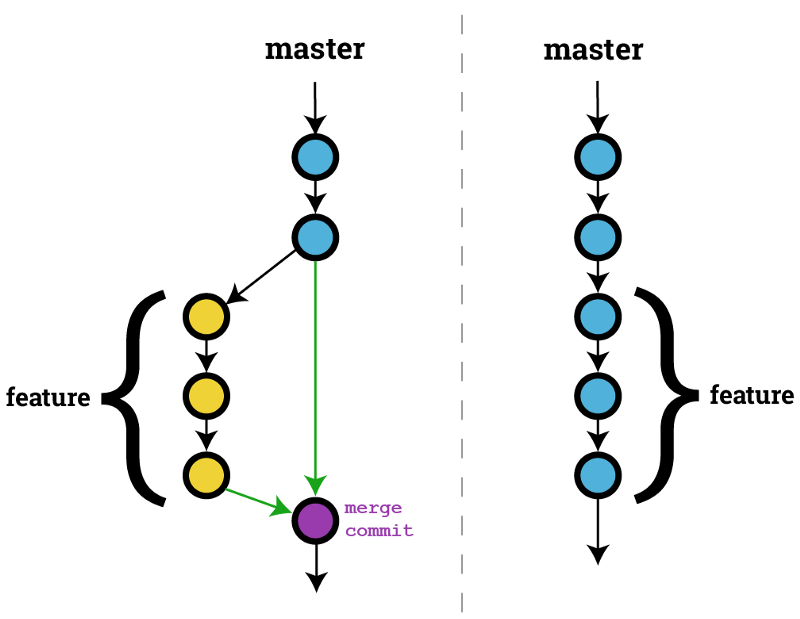
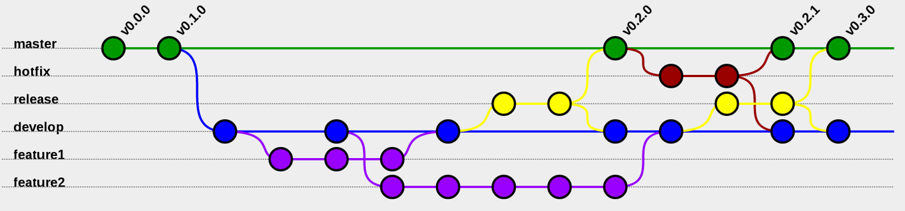

# Intro to Unix and Git for Academics

This is a very gentle introduction for non-programmers to the most basic, text-based
ways to do things with a computer: the Unix (or Linux) command line. Sometimes considered
arcane, off-putting, or just old-fashioned, a bit of command line knowledge is still
required for much digital humanities and social science work, even on a modern Mac or PC --
knowledge that is too often treated as implicit, but too seldom taught. We will also
cover the basics of Git, the near-universal version-control system that is one of basic
toolkits of digital scholarship and especially collaboration. This workshop is a safe
space for people of all experience levels, with no question too basic to ask!

Prerequisites: None. Please bring your own computer. It would be helpful before the
class to create a free account on http://github.com if you don’t have one.

## Learning goals

- To understand what the command line is, and how it relates to our customary graphical user interfaces
- To understand files, directories, paths, commands, and how they interact
- To become familiar with 10 Unix commands with their syntax
- To be introduced to 2 Unix programs (for editing text and transferring files)
- To become familiar with version control using Git

## Pre-workshop prep

### Windows: install Git Bash

[https://gitforwindows.org/] --
which provides both a Unix-like shell and Git.

### Mac: install Git

[https://git-scm.com/downloads]

## PART I. Unix and the command line

### What are they, and why do we care about them?

- The command line is a text-only (i.e., keyboard-only) way to interact with a computer
- Unix (or Linux, a variant of Unix) is the basis of a huge number of computers:
  - the vast majority of web servers
  - your space on Stanford's servers
  - your Mac (it's the "X" in "OS X")
  - your Windows machine (as an emulator)
- Many operations, esp. bulk operations, are faster and clearer from the command line
- It's a peek behind the scenes, good for troubleshooting, good for understanding what's going on
- It's assumed, tacit knowledge among people working with computers

### How to get started

**Try it:**

- on a Mac: `Terminal` app
- on Windows: `Git Bash` program

### Defining terms

- Shell, command line, prompt
- File
- Directory
- Path
- Command (or program)

### Unix syntax: a language analogy

Most Unix commands follow some version of the following syntax:

- `command` `-flag(s)` `object1` `object2`
- ...then push `ENTER` to execute the command

Although these commands may initially seem arcane or esoteric, their syntax is a close analog to human language:

- Verb + Adverb + DirectObject + IndirectObject
- ...followed by punctuation to end the sentence.

For example,

`cp -i text.txt backup/.`

means something like, "Copy interactively the file "text" to the "backup" directory."

Just as not all verbs take direct or indirect objects, so not all commands require objects;
likewise, neither adverbs nor "flags" (a.k.a. "options") are always required for meaningful
sentences or commands.

### A few essential Unix commands and options

`ls`: **list** what's in a directory

> `ls -l`: list in **long** format
>
> `ls -a`: list **all** files (including special & hidden files)
>
> `ls -h`: list file sizes in **human**-readable format
>
> `ls -F`: list files with **Final** characters indicating what type of files they are. Directories will end in `/`
>
> With no object, `ls` lists what's in the current directory; if a different directory is in the object position, it lists the contents of that directory

- **Try it:** In your terminal, try the `ls` command with and without these flags.  
  Outside your terminal, open a Finder window (Mac) or Explorer (Windows) and compare what you
  see. Find the folder in your "normal" (GUI) desktop that corresponds to the directory you're
  listing on the command line.

`man [command]` or `[command] --help`: show the **manual** or **help** screen for a particular command

- **Try it:** In your terminal, try `man ls` (or on Windows, `ls --help`) to see the manual (including dozens of options) for this command.

> Page down in this "manual" file using the `SPACE` bar; page up using the `B` (for **back**) key; quit the manual using the `Q` key.

`pwd`: **present working directory** (i.e., "what directory am I in?")

- **Try it:** `pwd`

`cd`: **change directory**

> **_Directory symbols_**
>
> `/`: the root directory _and_ the directory separator in a path
>
> `./`: the current directory
>
> `../`: the parent directory (relative to the current directory)
>
> `~`: your home directory

- **Try it:** Change directories to the root `cd /`, then back to your home directory `cd ~`
  (or `cd` with no argument).
- Check whether you're in your home directory: `pwd`
- Change to the parent directory of your home directory: `cd ../` and note what it's called.
- Change back to your home directory: `cd`.
- See what subdirectories you have in your home directory: `ls -F` (look for the trailing `/` character).
- Change to one of those subdirectories, see what's in it: `ls -F`, then change to yet a deeper subdirectory, and see what's in that.
- Check your _present working directory_ (i.e., which directory you're in now): `pwd`.
- Change back to your home directory: `cd`.

`mkdir`: **make a new directory**

- **Try it:** `mkdir tmp`
  That is, "make a new directory called 'tmp.'
  If you don't already have a temporary directory in your home directory,
  now's a good time to make one.
- See what's in that subdirectory: `ls tmp/`. (It should be empty if you just created it!)
- Change to your new "tmp" directory: `cd tmp`.
- Confirm that you're actually in that directory: `pwd`

`touch`: **create a new file** (or change the "last touched" date of an existing file)

- **Try it:** `touch test.txt`
  That is, "create a new file called 'test.txt'." It will be empty; we'll just use it
  for practice today.

`cp`: **copy** a file to another file (and/or location)

> The first argument is the file you want to copy; the second is the destination of that copy:
> either what you want the copy to be named, and/or which directory you want it to be in.
> A `.` means to keep the same file name for a copy in a different directory.

- **Try it:**
- `cp test.txt copy.txt` (That is, create a copy of the "test.txt" file, and call it "copy.txt".)
- `ls` to see that you now have two files in your `tmp` directory.
- `ls -l` to confirm that these are identical: they'll have the same size and other details.
- Make another new directory (which will be a subdirectory of the current one), and copy your test file into it: `mkdir subtmp`, then `cp test.txt subtmp/.`
- Look at the file in both places: `ls` (for the current directory), and `ls subtmp` (for your new subdirectory)
- Make a couple of extra copies of the file: `cp test.txt a-copy.txt`; then `cp test.txt b-copy.txt`; then `cp test.txt c-copy.txt`; etc.

Look at the shortcuts below: try the up-arrow shortcut to redo your last command,
then edit the command (backspace over the last filename, and enter a new filename).

`mv`: **move** (or rename) a file (or directory)

> The first argument is the thing you want to move, and the second is the place you want to move it to.

- **Try it:** `pwd` to remind yourself which directory you're in, then
  - `ls` to remind you of which files are in this directory
  - `mv copy.txt subtmp` to move the file "copy.txt" to your new subdirectory
  - `ls` to confirm that it's no longer where it was before
  - `cd subtmp` to change to your subdirectory, and `ls` to see what's there
  - Now use `mv` just to change the name of the file: `mv a-copy.txt z-copy.txt` in the same directory
  - `ls` to see what you've got left in this directory

`rm`: **remove** (a.k.a. delete) a file

> `-r`: remove recursively: DANGER!

- **Try it:** Delete that z-copy.txt with `rm z-copy.txt`

Look at the shortcuts below: try the `TAB` shortcut to use auto-completion
in order to delete one more file: `rm b` then `TAB` -- which should auto-complete to `b-copy.txt`

Look at the **punctuation** section below to create a few new files with a lot of text.

`cat`: **concatenate** (i.e., show the file contents on the screen)

- **Try it:** `cat mylist`

`wc`: **word count**

- **Try it:** `wc mylist` and `wc mylonglist`

`grep`: **search** for a pattern in some file(s)

- **Try it:** `grep "copy" mylist`

### Some punctuation for combining commands

> `|`: **pipe** the output of one command into another command
>
> `>`: **write the output of a command to a new file**
>
> `>>`: **write the output of a command to the end of an existing file**

- **Try it:** Create new files out of your directory listing: `ls > mylist`
  and `ls -l > mylonglist`

### Some helpful shortcuts

`TAB`: auto-completion for file and directory names

`↑`: cycle through the previous command(s)

`^C` (a.k.a. `CTRL-C`): **Cancel** the current process (an escape hatch)

### A few simple Unix programs for accessing remote computers

`ssh`: open a **secure shell** on a remote computer (server)
`ssh gworthey@rice.stanford.edu`

`sftp`: start a **secure File Transfer Protocol** session with a remote computer

### A few simple Unix text editors

`vi`: **visual editor**, an extremely bare-bones text editor

- `i` or `a`: change to "insert" mode
- `o` or `O`: open a new line and start "insert" mode
- `ESC`: exit "insert" mode and change to "command" mode
- `:` enter a command
  - `:u`: undo whatever you just did
  - `:w`: write out (i.e., save) the file
  - `:q`: quit the program
  - `:wq`: save the file, then quit the program
  - `:q!`: quit the program without saving the file
- `x`: delete a single character
- `dw`: delete a word
- `d3w`: delete three words
- `dd`: delete a line
- `3dd`: delete three lines
- `d$`: delete to the end of the line

`pico` and `nano`: slightly more user-friendly, menu-driven editors

- `^` indicates the `COMMAND` or `CMD` key, so...
  - `^O` means: "hold down the `COMMAND` key and press `O`"

### A Unix command-line cheat sheet

Image courtesy of [Noé Fernández-Pozo on Slideshare](https://www.slideshare.net/NoFernndezPozo/unix-command-sheet2014)

## PART II. Git

### Why do we care about version control and git?

- Addresses issue of multiple versions and drafts of files
- Provides capacity to easily move between different versions of files (a la Google Sheets, but locally)
- Facilitates collaboration
- Facilitates backup and storage through remote repositories/hosting
- Lets us work within a community standard technology/framework

### Let's make sure that git is installed for everyone.

- In terminal in Mac or Git Bash in Windows, type `git help`. If you get a long message with all the options for git, it's working fine.

### Conceptual model of git

- Working directory
- Staging area
- Local Git repository (repo for short)
- Remote Git repository

### Setting up git and Github

- Sign up for Github if you haven't: [Github](https://github.com/).
- Modify git config to set your email and username. For your email, keep it the same as the email you used to sign up with Github.
  - Username: `git config --global user.name "Mona Lisa"`
  - Email: `git config --global user.email "email@example.com"`

We're setting these options globally, meaning it's set for git for all of your directories or repositories. You can set your username and email per folder or directory, but this is typically only necessary if you have multiple remote repositories and different user accounts.

### Initializing a local git repository (`git init`)

- Create a new directory in terminal. You can put this directory whereever you would like. I like to have a `projects` folder on my computer where I keep all of my git repositories.
- `cd` into that directory.
- Within that directory, run `git init`.

### Your most important git command (`git status`)

- Within your new git directory, run `git status`. What sorts of information does this tell you?
- Create a new file in this directory. You could do this in Finder or using a different app and saving. But, let's stay in terminal. Try `touch test.txt`.
- Run `git status` again. What has changed?

### Telling git what to keep track of (`git add`)

- Check status (`git status`).
- `git add` tells Git which files to pay attention to. It also tells Git which files you want to include in the next snapshot of your files.
- Run `git add test.txt`
- Run `git status` again. What's changed? If you don't remember what the status looked like before you added this file, scroll up in your terminal until you see the previous output.

### Checking file changes (`git diff`)

Our whole point in using git is to be able to work with changing files and handle those changes responsibly. So, let's start to change our test file.

- Let's open our `test.txt` file using vi, which you used in the first part of this workshop. Try `vi test.txt`.
- Within your file, go ahead and write a line of text. Save your file, and exit so you're back at your normal shell.
- If you run `git status` now, what's changed?
- See what's changed in the files, run `git diff`.
- What do the plus and minus signs mean?

When we ran `git diff`, we asked for all the changes in all the files that git is keeping track of. If you wanted to just see changes to a single file, you can give that file path to git, like so: `git diff text.txt`.

### Telling git when to take a snapshot of your tracked files (`git commit`)

Git is structured by commits, which are soft of like snapshots of the changes made to the files in your repository. Git can then move between versions of files by applying or rewinding the different changes that have been made to the files. But git isn't like an autosave feature. You need to tell git when to take these snapshots (commits).

- Run `git status`.
- We previously made a change to our test file. Let's go ahead and commit that change, or take a snapshot of the changes to that file.
- Run `git add test.txt` to tell git to add our file to our staging area.
- Then run `git commit -m "Adds new text"`. What do you think the `-m` and short text in quotations marks are?
- Run `git status`. What's changed?

#### Advanced: writing good commit messages

Above, we wrote an inline commit message, something short and to the point that would indicate what the changes in the commit are. If we don't specify that `-m` flag, git will instead open your default text editor, likely vi or vim. In there, we can write a longer multi-line commit message, especially for commits where we have multiple files and multiple changes.

- Reopen your `test.txt` file in vi.
- Make some more changes.
- `git status`
- What should you do now to tell git to include this file in the next commit?
- Now, let's run `git commit` but don't pass it the `-m` flag or a message. Within the editor that opens, write a short summary message, and below, use dashes to make a list of specific changes. When you then save and exit vi, you should see git finish the commit.

### Checking our git history (`git log`)

Suppose we want to see all of the commits we've made in our repository. We may want to just see what changes we've made, or we might need to move backward in versions.

- Type `git log`.
- What do you see? Let's walk through each piece of the log.
- There are different options we can give `git log` to see different types of output.
- Try `git log --stat`.
- Try `git log -p -1`.
- What did each of these do?

### Remote repositories (`git push` and `git pull`)

At this point, we've worked entirely locally. Our files are on our own computers, as is the git repository that is tracking all of our changes by way of commits. Part of what is nice about git, though, is that there are a bunch of different online repositories where you can sync your repository. This allows for collaboration, open source in software development, and a built-in (though self-managed) backup solution for your versioned files. We'll use Github, the most well-known of these remote repositories.

- Go to Github in your browser, and sign in to the account you created earlier.
- Go to your own user page, then click the "Repositories" tab.
- Hit "New", then fill out the form with a name for your repository. The rest of the fields are optional.
- Since we already have a git repository, we'll follow the set of instructions to add this "remote" to an existing repository.
- `git remote add origin https://github.com/username/reponame.git`
- In order to sync the remote repository with our local repository, we'll "push" our commits there: `git push -u origin master`.
- In this case, "origin" is the name of the "remote" repository we're using. This name is set locally for each repository, and it's the default setting. We need these names because it's possible to have multiple remote repositories for a local repository.
- "Master" refers to which branch we're on. For now, we're not going to work about git's branching model. That's where a lot of complexity comes from, and we can do quite a lot with git without touching that.
- Once this command has run successfully, refresh your browser and you should see your test file there in Github along with your commits so far.
- After this, you can just run `git push` without the rest. We only need to add other parameters if we're working on multiple branches or with multiple remotes.

We've pushed our commits from our local repository to our remote repository with `git push`. But, what if we're working with someone else, or working on multiple computers, and there are commits on our remote repository that we don't have on our local machine?

- Run `git status`. You should see a message about whether your local version is up-to-date with the remote.
- Even though it won't do anything at this point, since our local and remote are in sync, run `git pull`. If there had been changes we didn't have, this would download those changes, and merge them into our local files as long as there aren't conflicts. More on that shortly.

### Practice (full workflow):

Here's a standard workflow I use with git, assuming an already created repository with a remote.

- Check to see if I have changes that aren't committed: `git status`
- Check Github to see if there are changes on the remote that I need to have locally. When you ran `git status` you would also see if there are differences between local and remote. If so, commit my changes then pull:
  - `git add filename.ext`
  - `git commit -m message`
  - `git pull`
- At this point, we can work as normal, and make any changes to our files we want to.
- Check status when we're done making changes: `git status`.
- Add the files we want to commit to our staging area: `git add filename.ext`.
- Commit the files with a message: `git commit -m message`
- Push our changes to the remote repository: `git push`

Try running through this full workflow one time, and then we'll move to a bit about collaborating with git.

### Collaborating with git (fixing merge conflicts)

One model of collaboration with git is to have everyone working on a single branch with a single remote repository. Each collaborator has a version of that repository locally, makes whatever changes they need to, then pushes their commits to the remote. Each time someone works, they would run through the workflow above, pulling down changes before they do their own work and push it up to the remote.

One advantage of this model is clarity. There is a single source of truth that is the single branch as it lives on the remote repository. If everyone agrees to that and to the working model, they never have to wonder what the most recent version of some file is.

There is a disadvantage, though. With more people working on the same branch and pushing regularly to the remote repository, you are much more likely to have merge conflicts that you have to fix. Merge conflicts occur when you pull down changes from the remote (`git pull`), but there are parts of your local files that are different from the version you're pulling down. When you run `git pull`, git does it's best to merge the two versions together. But if it can't because of conflicts, it makes you resolve those conflicts, choosing the version of the file to keep.

We aren't going to try to generate merge conflicts in your own repositories today, but we will demonstrate one.

- Co-teacher will edit the title of this file, commit it, then push to the remote.
- I'll edit the same title, and commit it, but **not** push.
- Then, I'll pull down the remote. We should get a merge conflict.
- Within the file, we'll choose which version we want to keep, or blend the versions.
- Then, `git add` the file, and `git commit` to commit the merge.

With this, we do get great transparency. The merge commit shows that a decision was made between two versions of a file, and that decision is another change that we can track and revert if needed.

### The branching model - a sneak peak at more advanced collaboration

We unfortunately don't have time to work through the branching model of git, but, time permitting, let's talk about it briefly so you have a sense of it.

The branching model is the standard way of collaborating in software engineering where the project is managed with git. We use branches and a particular workflow all the time for digital projects in CIDR. The advantage is a better capacity to have multiple people working on a single project. The branching model cuts down on merge conflicts, encourages people reviewing each other's work, and can protect from introducing inadvertant bugs or errors into the work.

Here's a simple version of branching:

Image courtesy of [this tutorial on git branches and merging](https://medium.com/@haydar_ai/learning-how-to-git-merging-branches-and-resolving-conflict-61652834d4b0).

Here's a more complex example:

Image courtesy of [this write-up of a fairly normal complex branching workflow](https://medium.com/@stansarr/git-workflow-branches-strategy-4d29f9b2a417).

I think it's almost always worth it for teams of more than a couple of people to use a branching workflow, but it is more complex, a bit harder to learn, and requires more from the people participating. At the end of the day, any approach where you use version control where you didn't before is almost always better, regardless of your workflow model.

### Cheat Sheet

### GUI Git

We've been teaching you to use the command line or terminal, so we used git in the terminal. That's how I use it on an almost daily basis, and it provides a tremendous amount of power once you get used to it and if you use advanced features.

But, you can use graphical interfaces also, and it's great to do so. Several companies have built graphical interfaces that make it easier to do all the basic things in git, which covers 90% of what most people do. So, feel free to download one of these applications and use it. By going through what we've done on the command line, hopefully what you might do in a graphical interface will be clearer.

[Github Desktop](https://desktop.github.com/) - easy to use, perfect integration with Github
[Git Kraken](https://www.gitkraken.com/git-client) - more complex, but offers access to more advanced git features.
[Sublime Merge](https://www.sublimemerge.com/) - a GUI client from the makers of one of the best code editors out there.

-- Or --

Use a text editor with Git features built in, such as:

- [VS CODE](https://code.visualstudio.com/)
- [Atom](https://atom.io/)

## Quick eval survey:

https://stanforduniversity.qualtrics.com/jfe/form/SV_cZRxW2wvnMDSy57
