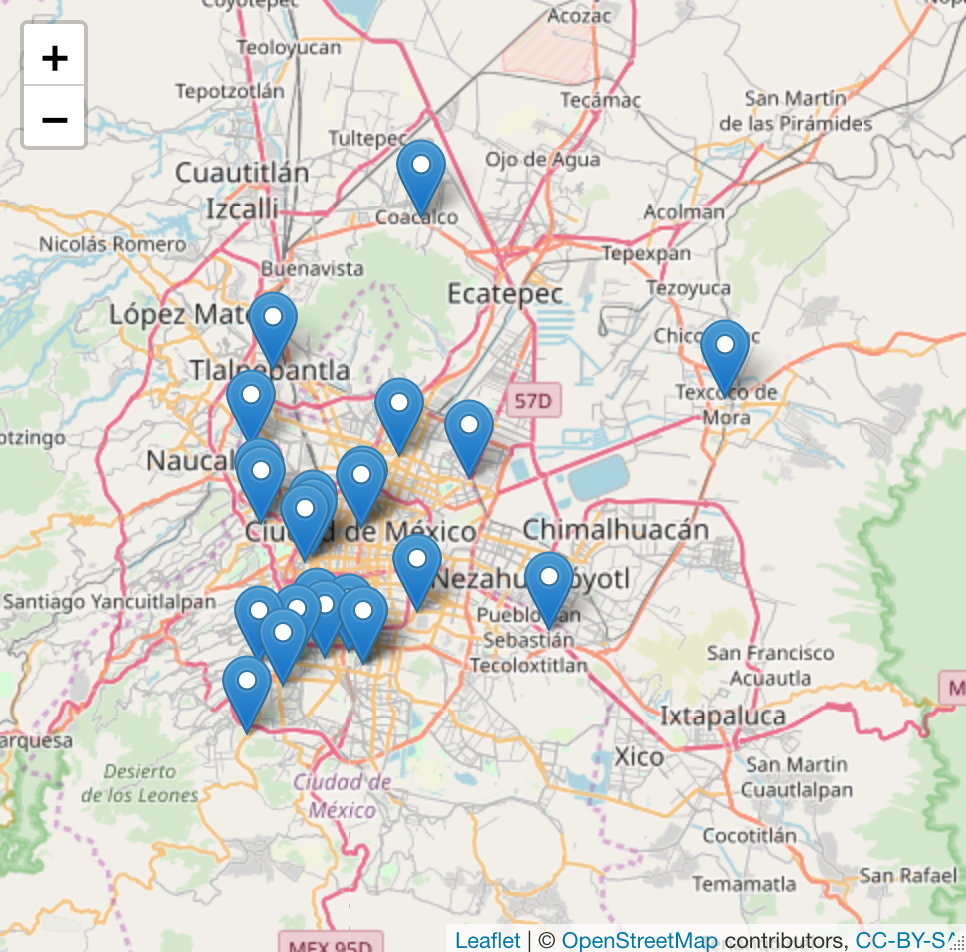

# Finding and Using Social Media Data

Have questions after the workshop? Get in touch with us at contact-cidr[at]stanford.edu

## Learning goals

By the end of this workshop, we hope you'll have a good sense of legal and ethical concerns when trying to collect and use social media data, along with strategies for finding existing data and collecting new data.

## Outline

- Fundamental questions and approaches
- Commonly requested sources (Facebook, Twitter, etc.)
- Examples analyses with Twitter data

## Fundamental questions and approaches

- What are "Social Media"?
- Why don't we just scrape it?
  - Licensing
  - Terms of Service
  - What to look for in Licenses or Terms of Service pages
    - Search for terms like data mining, scrape/scraping, robot, spider, crawl, automated, extract.
  - Ethical concerns regarding privacy
  - Many social media companies make it incredibly difficult to scrape their content, and code in ways to detect and prevent scraping attempts. When we say, as we will for many companies, don't scrape this company's content, we're indicating the legal and ethical issues, as well as the technical problematics.
- Using existing data
  - There are social media datasets floating around reddit and other places with different amounts of documentation. You have to make a decision about whether they can be used or not based on your use case and discipline. You should absolutely be thinking about how the data was collected and whether use of that data violates legal restrictions or ethical best practices.
  - There are a lot of repositories out there with documented data as well.
  - Many of the existing datasets will not match your particular research question, but you might be able to subset them to create a suitable dataset.
- Creating your own datasets
  - APIs and associated libraries for programming languages
    - An API is not necessarily a way to scrape data; it is often built for application developers to use, not for data collection.
  - Social Feed Manager
- Opportunities for working directly with companies

## Commonly requested sources

### Facebook

- https://newsroom.fb.com/news/2018/04/restricting-data-access/
- http://theconversation.com/facebooks-data-lockdown-is-a-disaster-for-academic-researchers-94533
- https://developers.facebook.com/docs/graph-api/

First, don't scrape Facebook. It's unlikely to work and it's definitely against the terms of service.

A lot of people are interested in collecting posts from public Facebook Groups. It used to be possible to use a Facebook API to collect this data. After the Cambridge Analytica scandal, Facebook is almost entirely locked down. While the Graph API is still around, you have to establish a Facebook Developer profile for yourself as a business (complete with official business documentation) that's providing services of some sort to users or other businesses to even access the most basic public information for pages.

Existing data: you can find stray Facebook datasets on reddit, data.world, and other places on the internet. However, given the lack of clarity around how the data were collected and such, it's unlikely these could be used for publishable research. You can also find occasional datasets released by people who own the Facebook data, such as cities who are providing information about their communications, though this data is often metadata rather the posts and comments themselves.

Collaboration: Facebook periodically puts out RFPs for [research collaborations](https://research.fb.com/programs/). You can sign up for their mailing list to receive the RFPs, but they're focused on technical issues relevant to Facebook's own interests (including things like multilingual NLP, but not sociocultural phenomena).

### Instagram

Instagram is owned by Facebook. When Facebook locked itself down, it locked down Instagram's API.

- https://www.instagram.com/developer/

And, of course, you can't scrape Instagram.

- https://help.instagram.com/581066165581870

> You can't attempt to create accounts or access or collect information in unauthorized ways.
> This includes creating accounts or collecting information in an automated way without our express permission.

### Twitter

Don't scrape Twitter. Use the Twitter API:

- https://help.twitter.com/en/rules-and-policies/twitter-api
- https://developer.twitter.com/en/docs
- https://developer.twitter.com/en/products/products-overview
- https://developer.twitter.com/en/pricing

https://developer.twitter.com/en/docs/basics/things-every-developer-should-know.html

> There are different API families

> The standard (free) Twitter APIs consist of REST APIs and Streaming APIs.

> The enterprise (paid subscription) APIs include filtered firehose, historical search and engagement APIs for deeper data analytics, listening and other enterprise business applications.

> The premium (pay as you go) APIs consist of reliable and affordable versions of enterprise APIs, allowing your business to grow with your usage.

With the API, you can build up very large custom sets of tweets for your work, as long as you are following all of the requirements and terms. There is a key limitation for the publication or sharing of that data, though: Twitter's ToS do not allow you to publish collections of entire tweets, but only lists or sets of Tweet IDs. This is what is called "dehydrated" data. You can then "rehydrate" itself by hitting the Twitter API and retrieving that tweet based on the ID. This is in part because Twitter tries to respect when tweets are deleted by users. If a tweet is deleted, the API won't be able to obtain it.

Here's more of their documentation on "being a good partner" in using the Twitter API and collecting tweets: https://developer.twitter.com/en/developer-terms/agreement-and-policy#f-be-a-good-partner-to-twitter

For an overview that Justin Littman put together on finding existing data: https://gwu-libraries.github.io/sfm-ui/posts/2017-09-14-twitter-data. There are a few changes to recognize. Companies like DiscoverText that have traditionally provided paid access to historical Twitter data are not always able to provide such access anymore in the wake of Twitter becoming more careful with access.

There are existing datasets out and about including those linked at these two places:

- https://www.docnow.io/catalog/
- https://tweetsets.library.gwu.edu/

You should always check with your library's digital repository or data curator to determine whether your (or other libraries) have datasets.

You can also use Social Feed Manager to manage your own tweet harvesting.

### Sina Weibo

Much like Twitter, Sina Weibo has an API that you can use directly or through different programming libraries or applications to create new datasets.

You can also use Social Feed Manager as a way to manage your API access.

### Yelp

Yelp makes a relatively large dataset available for educational and academic purposes: https://www.yelp.com/dataset

Don't scrape Yelp. From the Yelp terms of service (https://www.yelp.com/static?p=tos):

> You also agree not to, and will not assist, encourage, or enable others to:

> Use any robot, spider, site search/retrieval application, or other automated device, process or means to access, retrieve, scrape, or index any portion of the Site or any Site Content;

### Reddit

Reddit has an API that you can use to gather Reddit data, and there are a number of libraries for different languages to assist with using the API.

There are also quite a few Reddit corpora floating around the internet. As always, make sure you understand what's contained in the data, how it was gathered, and so forth.

### Tumblr

Following the terms of service, you should also not scrape Tumblr - https://www.tumblr.com/policy/en/terms-of-service (see the "Limitations on Automated Use").

There is an API of limited usefulness. See limitations here - https://www.tumblr.com/docs/en/api_agreement - this includes a provision whereby you cannot store Tumble data for more than 3 days.

And there are existing datasets out there, such as this interesting data on gifs with descriptions: https://www.kaggle.com/raingo/tumblr-gif-description-dataset.

## Places to search for data

- https://archive.ics.uci.edu/ml/index.php
- https://snap.stanford.edu/data/
- http://socialcomputing.asu.edu/pages/datasets
- https://aminer.org/data-sna
- https://www.kaggle.com/datasets
- https://toolbox.google.com/datasetsearch
- https://www.data.gov/
- https://www.docnow.io/catalog/
- http://files.pushshift.io

## An example analysis with Twitter data with R

This is a demo only, using tweets harvested with the Social Feed Manager as csv file.

```R
library(tidyverse)
library(leaflet)

cdmx <- read_csv("CDMX_tweets.csv") # read in the tweets

cdmx %>%
  filter(grepl("\U0001f602", text), # filter for a particular string
         !is.na(coordinates)) %>%  # remove records without coordinates
  separate(coordinates, c("lon", "lat"), sep = " ", convert = T) %>%  # turn into lat/lon
  leaflet() %>%
     addTiles() %>%  # Add default OpenStreetMap map tiles
     addMarkers(~lon, ~lat, popup = ~as.character(text),
             label = ~as.character("\U0001F602"),
             labelOptions = labelOptions(textsize = "30px"))

```



## An example analysis with Twitter data with Python

This is an example of using text analysis techniques on a set of tweets related to Charlottesville and Christianity, drawn from TweetSets and rehydrated with Twarc.

First, we can just see what the top words are based on raw count across all the tweets.

```Python

import textacy
import json
import pandas as pd
import textacy.vsm
import textacy.tm

loc = "tweets.jsonl"

data = []

with open(loc, "r") as f:
    for line in f:
        data.append(line)

tweets = [json.loads(single)["full_text"] for single in data]

corpus = textacy.Corpus("en", data=tweets)

word_counts = corpus.word_counts(as_strings=True, normalize="lower")
sorted(word_counts.items(), key=lambda x: x[1], reverse=True)[:20]
```

```
[('charlottesville', 1613),
 ('christian', 1562),
 ('white', 545),
 ('christianity', 255),
 ('response', 224),
 ('amp', 202),
 ('trump', 182),
 ('church', 155),
 ('racism', 138),
 ('radical', 133),
 ('terrorism', 129),
 ('today', 117),
 ('hate', 100),
 ('terrorists', 97),
 ('american', 93),
 ('terrorist', 91),
 ('right', 88),
 ('latest', 83),
 ('@realdonaldtrump', 81),
 ('god', 81)]
```

Moving more into full text analysis, we could build a topic model of the tweets to understand the themes of the corpus of tweets. Here's a first pass without doing any cleaning of the text whatsoever other than lowercasing.

```Python

vectorizer = textacy.vsm.Vectorizer(
    tf_type="linear", apply_idf=True, idf_type="smooth", norm="l2",
    min_df=2, max_df=0.95)

doc_term_matrix = vectorizer.fit_transform(
    (doc._.to_terms_list(ngrams=1, entities=True, as_strings=True, normalize="lower")
    for doc in corpus))

model = textacy.tm.TopicModel("lda", n_topics=40)
model.fit(doc_term_matrix)
doc_topic_matrix = model.transform(doc_term_matrix)
for topic_idx, top_terms in model.top_topic_terms(vectorizer.id_to_term, top_n=10):
    print("topic", topic_idx, ":", "   ".join(top_terms))

```

```
topic 0 : #charlottesville   🤔   retweeted   weekend   excellent   school   en   son   one   last weekend
topic 1 : prove   establishment   release   mutually   exclusive   horrific   american   racial   https://t.co/uhqieflxsz   guard
topic 2 : person   dignity   result   foundation   image   build   forgive   bring   belief   tear
topic 3 : charlottesville   christian   bible   read   2   great   look   prayer   kind   sick
topic 4 : especially   offended   unity   @foxnews   #   judge   christian   charlottesville   describe   @judgejeanine
topic 5 : gop   maga   ccot   tcot   woman   republican   military   student   democrat   2a
topic 6 : question   mind   think   #   christian   kwilli1046   chance   charlottesville   EU   💯
topic 7 : exactly   neonazis   finally   sure   identify   home   reality   #   ass   dumb
topic 8 : thread   right   good   alt   shame   christian   charlottesville   @jerryfalwelljr   community   👇
topic 9 : find   lot   role   complete   insidious   hat   christian   huge   america   ppl
topic 10 : fucking   radicalization   piece   idiot   break   @stylewiseblog   concerned   scum   hit   guy
topic 11 : news   trump   charlottesville   christian   8/14/17   terrorists   lifestyle   #   moron   tiki
topic 12 : @ctmagazine   statement   catholic   fascist   life   oh   n   ignorant   https://t.co/wdnbdk09pk   murder
topic 13 : usa   praying4   mondaymotivation   unfortunately   charlottesville   interest   demand   non   ethnic   two
topic 14 : problem   little   promote   courage   armed   honestly   @sojourners   big   indefensible   angry
topic 15 : american   christian   charlottesville   terrorist   supremacist   nazi   white   evangelical   neo   trump
topic 16 : @edstetzer   church   response   christian   charlottesville   literally   african american   african   friend   continue
topic 17 : start   amen   reaction   oppression   brother   awful   thankful   swear   privilege   good
topic 18 : leader   university   president   lead   solidarity   attention   christian   question   press   hispanic
topic 19 : standwithcharlottesville   willingly   23   enabler   die   clergy   🔥   pastor   love   🏻
topic 20 : blind   capital   quiet   eye   piss   strong   council   racist   political   hear
topic 21 : jesus   evil   violence   faith   man   christian   charlottesville   want   history   hear
topic 22 : got   ️   obviously   employ   dog   ✡   christian   week   stand   know
topic 23 : lay   charlottesville   heal   unitetheright   bad   r   think   want   pastor   @realdonaldtrump
topic 24 : defendcville   🔥   mention   believe   #   helpful   appropriate   charlottsville   nonewkkk   interesting
topic 25 : driver   silence   @mike_pence   light   lgbtq   example   glad   strong   anymore   moral
topic 26 : worth   qualify   count   paper   detestable   brilliant   ironically   authority   sit   christian
topic 27 : away   ago   name   large   biblical   charlottesville   racism   hatred   think   news
topic 28 : christianity   god   love   charlottesville   racism   christ   think   christian   represent   need
topic 29 : response   today   morning   church   tomorrow   christian   charlottesville   ’s   defeat   violent
topic 30 : know   patriot   inform   patriotic   feel   btw   enemy   disappointed   german   bear
topic 31 : fear   change   version   judgement   @franklin_graham   profess   twisted   need   pure   reaction
topic 32 : u   wonder   guy   ur   r   consider   hard   trust   feel   thug
topic 33 : charlottesville   heatherheyer   christian   terrorists   radical   like   white   @potus   race   trump
topic 34 : charlottesville   christian   #   white   non   muslim   attack   amp   terrorist   thank
topic 35 : sad   wonderful   check   hilarious   pun   endabortionnow   practice   reflection   charlottesville   ’s
topic 36 : white   charlottesville   christian   terrorism   amp   radical   racism   christianity   supremacy   trump
topic 37 : gain   special   personal   sad day   day   uva   sad   hell   believe   shame
topic 38 : #   charlottesville   anti   christian   racist   truth   virginia   vigil   week   true
topic 39 : blacklivesmatter   antifa   liberal   jewish   islam   cnn   republican   conservative   alllivesmater   1/2
```

## Resources

SAGE handbook of social media research methods - https://searchworks.stanford.edu/view/11999820

Salganik, MJ (2018): _Bit by bit : social research in the digital age_ Princeton, New Jersey : Princeton University Press. https://searchworks.stanford.edu/view/12380521

Townsend, L and Wallace, C (2016): _Social Media Research: A Guide to Ethics._ http://dotrural.ac.uk/socialmediaresearchethics.pdf
